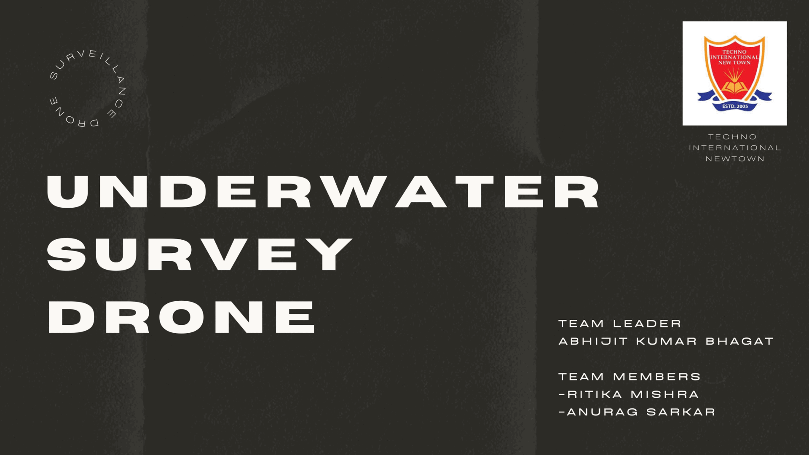

# UNDERWATER SURVEY DRONE  
## The project involves a prototype drone designed for underwater surveys. 
## The drone is equipped to detect underwater temperature and is aimed at facilitating underwater surveying.

